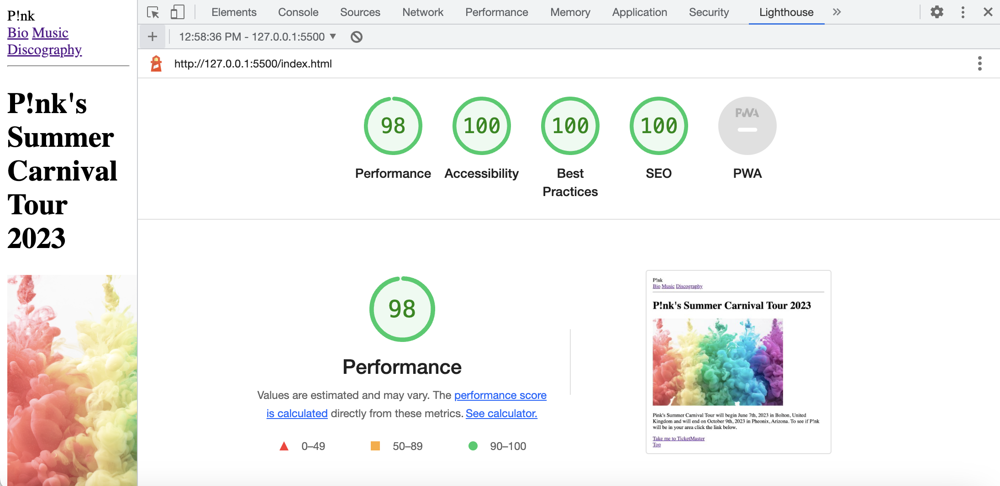
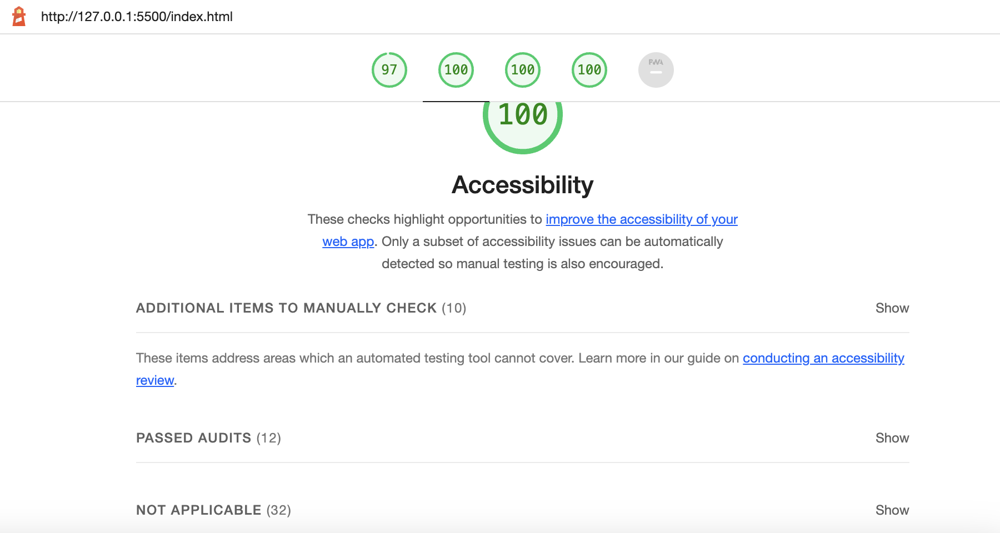
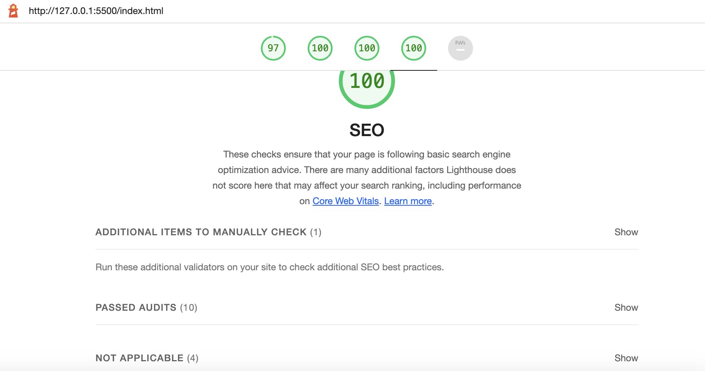

# Lighthouse Reports

## Dashboard Screenshot

## Acessibility Screenshot

## SEO Screenshot

## Stumbling Blocks for Assignment 3
I struggled with understanding the appropirate way to utilize articles. I wasn't sure if articles should be within section elements or if section elements should be used within article elements. The explanation from the live session on Thursday helped me gain a better understanding on how to create a structure for article elements. However, I still don't feel like I have a solid understanding of when to use the article element. Therefore, I'm not sure if I used it correctly in my markup. 